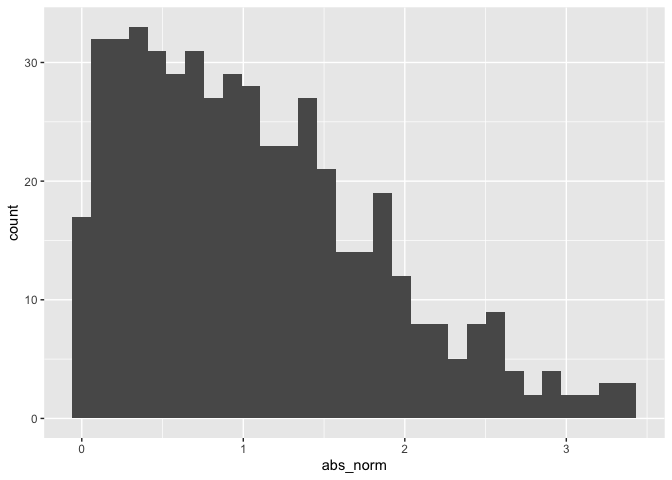

Simple document
================

``` r
library(tidyverse)
```

    ## ── Attaching packages ─────────────────────────────────────── tidyverse 1.3.2 ──
    ## ✔ ggplot2 3.3.6      ✔ purrr   0.3.4 
    ## ✔ tibble  3.1.8      ✔ dplyr   1.0.10
    ## ✔ tidyr   1.2.0      ✔ stringr 1.4.1 
    ## ✔ readr   2.1.2      ✔ forcats 0.5.2 
    ## ── Conflicts ────────────────────────────────────────── tidyverse_conflicts() ──
    ## ✖ dplyr::filter() masks stats::filter()
    ## ✖ dplyr::lag()    masks stats::lag()

I’m an R Markdown document!

# Section 1

Here’s a **code chunk** that samples from a *normal distribution*:

``` r
samp = rnorm(100)
length(samp)
```

    ## [1] 100

# Section 2

I can take the mean of the sample, too! The mean is -0.1092923. The
rounded mean is -0.11.

# Section 3

This is going to make a plot! First I generate a dataframe, then use
`ggplot` to make a scatterplot.

Note: The way to insert code chunk on a Mac is OPT + CMD + i

``` r
plot_df = 
  tibble(
    x = rnorm(n = 1000),
    y = 1 + 2  * x +rnorm (n = 1000)
  )
```

deleting histogram also

## Plot from learning assessment

``` r
library(tidyverse)
la_df = 
  tibble(
    norm = rnorm(n = 500, mean = 1),
    logical = norm > 0, 
    abs_norm = abs(norm)
  )
  ggplot(la_df, aes(x = abs_norm)) + geom_histogram()
```

    ## `stat_bin()` using `bins = 30`. Pick better value with `binwidth`.

<!-- -->

``` r
  median_samp = median(pull(la_df, abs_norm))
```

Adding text to see if it works in git changing again!
